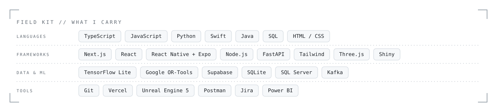

<picture>
<source media="(prefers-color-scheme: dark)" srcset="assets/header-dark.svg">
<source media="(prefers-color-scheme: light)" srcset="assets/header-light.svg">

</picture>

 

Ammar. Computer Science (co-op) at Toronto Metropolitan University. Just a person who wants to make it.

<table>
<tr><td><b>NOW</b></td><td>Luma, an iOS app · Laminar Health · <a href="https://ammarkashif.com">ammarkashif.com</a>, an interactive archive of everything I've made</td></tr>
</table>

<picture>
<source media="(prefers-color-scheme: dark)" srcset="assets/kit-dark.svg">
<source media="(prefers-color-scheme: light)" srcset="assets/kit-light.svg">

</picture>

<a href="https://ammarkashif.com"><b>ammarkashif.com</b></a> &nbsp;·&nbsp; <a href="https://www.linkedin.com/in/ammar-khan-84a31217a/">LinkedIn</a>

<code>LOG KEPT BY HAND · IF YOU'RE READING THIS, YOU FOUND THE SITE</code>

