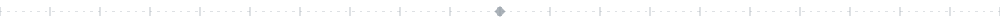
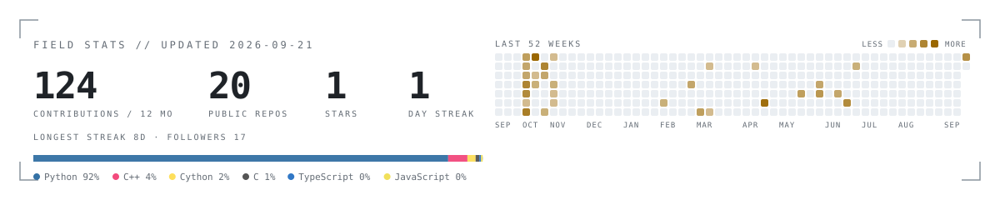

<picture>
<source media="(prefers-color-scheme: dark)" srcset="assets/header-dark.svg">
<source media="(prefers-color-scheme: light)" srcset="assets/header-light.svg">

</picture>

 

Ammar. Computer Science (co-op) at Toronto Metropolitan University, CTO at <a href="https://ammark134.github.io/laminar/">Laminar Health</a>. I build things, then go explore abandoned buildings with my friends. Just a person who wants to make it.

<table>
<tr><td><b>NOW</b></td><td>Luma, an iOS app · Laminar Health · a Three.js archive of everything I've made</td></tr>
<tr><td><b>STACK</b></td><td>TypeScript · Next.js · React Native · Swift · Python · FastAPI · Unreal Engine 5</td></tr>
</table>

<picture>
<source media="(prefers-color-scheme: dark)" srcset="assets/stats-dark.svg">
<source media="(prefers-color-scheme: light)" srcset="assets/stats-light.svg">

</picture>

<a href="https://www.linkedin.com/in/ammar-khan-84a31217a/">LinkedIn</a> &nbsp;·&nbsp; <a href="https://portfolio-delta-eight-21.vercel.app">Portfolio</a>

<code>LOG KEPT BY HAND · IF YOU'RE READING THIS, YOU FOUND THE SITE</code>

